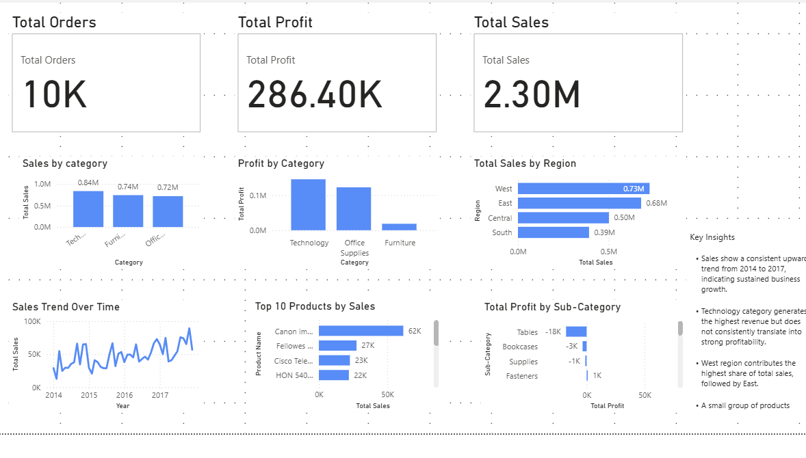

# Retail Sales Dashboard (Power BI)
An end-to-end data analytics project analyzing retail sales performance using Power BI, SQL, and Excel.

## Dashboard Preview

## Overview-
This project presents an end-to-end retail sales analysis using Power BI. The goal is to analyze business performance, identify key trends, and derive actionable insights.

Dataset
Source: Superstore dataset
Records: ~10,000 transactions
Fields: Sales, Profit, Discount, Category, Region, Product, Order Date

Tools Used
- Power BI (Dashboarding, DAX, Data Modeling)
- SQL (Data Analysis & Querying)
- Excel (Data Cleaning & Transformation)
- Data Visualization & Storytelling

Key Features
KPI Metrics: Total Sales, Profit, Orders
Sales & Profit by Category
Regional Sales Analysis
Monthly Sales Trend
Top 10 Products Analysis
Profitability by Sub-Category
Discount Impact Analysis

Key Insights
Sales show consistent growth over time, indicating business expansion
Technology category drives highest revenue but not always profitability
West region contributes the largest share of total sales
A small number of products generate a majority of revenue
Higher discount levels reduce profitability, highlighting pricing inefficiencies
Sub-categories like Tables show consistent losses despite sales

## Conclusion
This dashboard helps identify revenue drivers, profit leaks, and pricing inefficiencies, enabling better business decisions

## How to Use

1. Download the `.pbix` file  
2. Open in Power BI Desktop  
3. Use filters to explore insights across regions, categories, and products  

